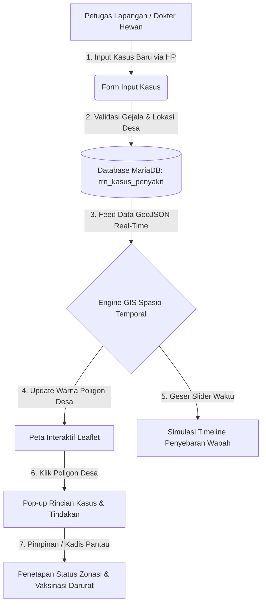

# 🗺️ RANCANGAN SISTEM SURVEILANS & PEMETAAN SPASIO-TEMPORAL PENYAKIT TERNAK & UNGGAS
**Dinas Peternakan dan Kesehatan Hewan Kabupaten Sinjai**
*Dokumen Spesifikasi Teknis, Desain Arsitektur, dan Blueprint UI/UX Sistem Informasi Kesehatan Hewan (GIS Timeline)*

---

## 📑 DAFTAR ISI
1. [Latar Belakang & Istilah Teknis Veteriner](#1-latar-belakang--istilah-teknis-veteriner)
2. [Klasifikasi Penyakit Hewan Menular Strategis (PHMS) Ternak & Unggas](#2-klasifikasi-penyakit-hewan-menular-strategis-phms-ternak--unggas)
3. [Rancangan Skema Database Spasio-Temporal (MySQL/MariaDB)](#3-rancangan-skema-database-spasio-temporal-mysqlmariadb)
4. [Arsitektur Backend & API GeoJSON (CodeIgniter 4)](#4-arsitektur-backend--api-geojson-codeigniter-4)
5. [Rancangan Komprehensif UI/UX (User Interface & User Experience)](#5-rancangan-komprehensif-uiux-user-interface--user-experience)
   - 5.1 Design System & Palet Warna Zonasi
   - 5.2 Wireframe Layar 1: Dashboard Peta Interaktif & Timeline Playback
   - 5.3 Wireframe Layar 2: Form Input Kasus Lapangan (Mobile-First)
   - 5.4 Wireframe Layar 3: Tabel Monitoring Kasus & Quick Status Update
   - 5.5 User Flow & Interaksi Pengguna
6. [Indikator Epidemiologi & Formula Zonasi](#6-indikator-epidemiologi--formula-zonasi)
7. [Tahapan & Rencana Implementasi (Roadmap)](#7-tahapan--rencana-implementasi-roadmap)

---

## 1. LATAR BELAKANG & ISTILAH TEKNIS VETERINER

Dalam bidang **Kesehatan Hewan (Keswan)** dan **Epidemiologi Veteriner** (mengacu pada standar Direktorat Jenderal Peternakan dan Kesehatan Hewan Kementan RI & sistem **iSIKHNAS**), pemantauan penyakit ternak harus mampu menjawab dua aspek krusial secara simultan: **DIMENSI RUANG** (Spasial/Lokasi Desa) dan **DIMENSI WAKTU** (Temporal/Perjalanan Kasus).

### Glosarium Istilah Kunci:
- **Surveilans Spasio-Temporal**: Analisis terintegrasi yang melacak kapan dan di mana suatu penyakit muncul, berkembang, menyebar, dan mereda pada unit administratif wilayah.
- **PHMS (Penyakit Hewan Menular Strategis)**: Penyakit hewan yang berpotensi menimbulkan morbiditas/mortalitas tinggi, dampak ekonomi luas, atau bahaya kesehatan masyarakat.
- **Zoonosis**: Penyakit hewan yang dapat menular secara langsung maupun tidak langsung ke manusia (contoh: Anthrax, Rabies, Flu Burung, Brucellosis).
- **Morbiditas (Attack Rate)**: Rasio jumlah ternak/unggas yang sakit terhadap total populasi rentan di lokasi kandang/wilayah.
- **Mortalitas (Case Fatality Rate / CFR)**: Tingkat fatalitas kematian dari seluruh ternak yang terinfeksi.
- **Zonasi Epidemiologi**: Penetapan tingkat risiko wilayah (Zona Merah/Wabah, Zona Kuning/Terancam, Zona Hijau/Bebas).
- **WKT (Well-Known Text)**: Format data geometris poligon batas wilayah desa yang dikonversi menjadi layer peta interaktif.

---

## 2. KLASIFIKASI PENYAKIT HEWAN MENULAR STRATEGIS (PHMS) TERNAK & UNGGAS

### A. Ruminansia Besar & Kecil (Sapi, Kerbau, Kambing)
| No | Kode | Nama Penyakit | Agen Penyebab | Komoditas | Karakteristik Klinis & Dampak |
|---|---|---|---|---|---|
| 1 | **PMK** | Mulut & Kuku (*FMD*) | Virus (*Aphthovirus*) | Sapi, Kerbau, Kambing | Lepuh pada lidah & gusi, kuku terlepas, hipersalivasi berbusa, penularan sangat cepat. |
| 2 | **ANT** | Anthrax (Radang Limpa) | Bakteri (*Bacillus anthracis*) | Ruminansia (**Zoonosis**) | Kematian mendadak, darah hitam keluar dari lubang alami tanpa membeku. Sangat fatal. |
| 3 | **LSD** | *Lumpy Skin Disease* | Virus (*Capripoxvirus*) | Sapi, Kerbau | Nodul/benjolan keras pada kulit seluruh tubuh, demam tinggi, penurunan bobot ekstrem. |
| 4 | **JEM** | Penyakit Jembrana | Virus (*Retroviridae*) | Khusus Sapi Bali | Demam akut, bengkak kelenjar limfa prefemoralis, keringat darah (*blood sweating*). |
| 5 | **SE** | Ngorok (*Septicaemia*) | Bakteri (*Pasteurella*) | Sapi, Kerbau | Busung leher/dada, sesak napas akut, suara mendengkur keras, demam tinggi. |
| 6 | **BRU** | Brucellosis (Keluron) | Bakteri (*Brucella abortus*) | Sapi, Kambing (**Zoonosis**) | Keguguran kebuntingan trimester akhir, retensi plasenta, kemajiran/infertilitas. |

### B. Komoditas Unggas (Ayam Broiler, Layer, Kampung, Itik/Bebek)
| No | Kode | Nama Penyakit | Agen Penyebab | Komoditas | Karakteristik Klinis & Dampak |
|---|---|---|---|---|---|
| 7 | **AI** | Flu Burung (*Avian Influenza*) | Virus (*Orthomyxovirus*) | Semua Unggas (**Zoonosis**) | Kematian massal sangat mendadak, jengger biru/sianosis, pendarahan bintik merah di kaki. |
| 8 | **ND** | Tetelo (*Newcastle Disease*) | Virus (*Paramyxovirus*) | Semua Jenis Unggas | Gejala saraf leher berputar (*tortikolis*), jalan melingkar, ngorok, mortalitas 100%. |
| 9 | **GUM** | Gumboro (*IBD*) | Virus (*Birnavirus*) | Anak Ayam (DOC) | Kerusakan bursa Fabricius, diare putih berlendir, ayam mematuk dubur sendiri. |
| 10 | **SNOT** | Coryza / Snot | Bakteri (*Avibacterium*) | Ayam Petelur & Pedaging | Muka & sinus bengkak berlendir bau busuk, nafsu makan hilang, produksi telur anjlok. |
| 11 | **PUL** | Pullorum (Berak Kapur) | Bakteri (*Salmonella*) | DOC & Unggas Muda | Feses putih kapur menempel di kloaka, sayap menggantung, pertumbuhan kerdil. |
| 12 | **FC** | Kolera Unggas (*Fowl Cholera*) | Bakteri (*Pasteurella*) | Ayam, Bebek, Kalkun | Diare hijau kekuningan, jengger bengkak merah gelap, radang sendi kaki. |

---

## 3. RANCANGAN SKEMA DATABASE SPASIO-TEMPORAL (MYSQL/MARIADB)

```sql
-- --------------------------------------------------------
-- 1. Master Data Penyakit (Ternak & Unggas)
-- --------------------------------------------------------
CREATE TABLE IF NOT EXISTS `mst_penyakit` (
  `id_penyakit` int(11) NOT NULL AUTO_INCREMENT,
  `kode_penyakit` varchar(20) NOT NULL UNIQUE,
  `nama_penyakit` varchar(150) NOT NULL,
  `nama_ilmiah` varchar(150) DEFAULT NULL,
  `kelompok_hewan` enum('Ruminansia Besar', 'Ruminansia Kecil', 'Unggas', 'Non-Ruminansia') NOT NULL,
  `kategori_agen` enum('Virus', 'Bakteri', 'Parasit', 'Jamur', 'Lainnya') NOT NULL,
  `sifat_zoonosis` tinyint(1) NOT NULL DEFAULT 0,
  `spesies_rentan` varchar(255) DEFAULT NULL,
  `masa_inkubasi_hari` int(11) DEFAULT 14,
  `warna_marker` varchar(10) DEFAULT '#FF0000',
  `deskripsi_gejala` text DEFAULT NULL,
  `prosedur_darurat` text DEFAULT NULL,
  `created_at` timestamp DEFAULT CURRENT_TIMESTAMP,
  PRIMARY KEY (`id_penyakit`)
) ENGINE=InnoDB DEFAULT CHARSET=utf8mb4 COLLATE=utf8mb4_general_ci;

-- --------------------------------------------------------
-- 2. Transaksi Kasus Penyakit Spasio-Temporal
-- --------------------------------------------------------
CREATE TABLE IF NOT EXISTS `trn_kasus_penyakit` (
  `id_kasus` int(11) NOT NULL AUTO_INCREMENT,
  `no_laporan` varchar(50) NOT NULL UNIQUE,
  `id_penyakit` int(11) NOT NULL,
  `komoditas` enum('Sapi Potong', 'Sapi Perah', 'Kerbau', 'Kambing', 'Domba', 'Ayam Broiler', 'Ayam Layer', 'Ayam Kampung', 'Itik/Bebek', 'Lainnya') NOT NULL,
  `desa_id` bigint(20) NOT NULL,
  `kecamatan_id` int(11) NOT NULL,
  `dusun` varchar(100) DEFAULT NULL,
  `id_peternak` varchar(50) DEFAULT NULL,
  `nama_peternak_manual` varchar(150) DEFAULT NULL,
  `id_petugas` varchar(50) DEFAULT NULL,
  
  -- Dimensi Temporal Kasus
  `tanggal_lapor` date NOT NULL,
  `tanggal_kejadian` date NOT NULL,
  `tanggal_selesai` date DEFAULT NULL,
  
  -- Indikator Kuantitatif Kasus
  `populasi_rentan` int(11) NOT NULL DEFAULT 0,
  `jumlah_sakit` int(11) NOT NULL DEFAULT 1,
  `jumlah_sembuh` int(11) NOT NULL DEFAULT 0,
  `jumlah_mati` int(11) NOT NULL DEFAULT 0,
  `jumlah_potong_bersyarat` int(11) NOT NULL DEFAULT 0,
  
  -- Status Penanganan & Validasi Medis
  `status_kasus` enum('Suspek', 'Terkonfirmasi', 'Terkendali', 'Selesai') NOT NULL DEFAULT 'Suspek',
  `tindakan_penanganan` text DEFAULT NULL,
  `koordinat_gps` varchar(100) DEFAULT NULL,
  `foto_gejala` varchar(255) DEFAULT NULL,
  `keterangan` text DEFAULT NULL,
  `created_by` int(11) DEFAULT NULL,
  `created_at` timestamp DEFAULT CURRENT_TIMESTAMP,
  `updated_at` timestamp NULL DEFAULT NULL ON UPDATE CURRENT_TIMESTAMP,
  
  PRIMARY KEY (`id_kasus`),
  KEY `idx_tanggal` (`tanggal_kejadian`),
  KEY `idx_desa` (`desa_id`),
  KEY `idx_penyakit` (`id_penyakit`),
  CONSTRAINT `fk_kasus_penyakit` FOREIGN KEY (`id_penyakit`) REFERENCES `mst_penyakit` (`id_penyakit`) ON UPDATE CASCADE,
  CONSTRAINT `fk_kasus_desa` FOREIGN KEY (`desa_id`) REFERENCES `kode_desa` (`desa_id`) ON UPDATE CASCADE
) ENGINE=InnoDB DEFAULT CHARSET=utf8mb4 COLLATE=utf8mb4_general_ci;
```

---

## 4. ARSITEKTUR BACKEND & API GEOJSON (CODEIGNITER 4)

Endpoint REST API Spasio-Temporal yang menghasilkan data GeoJSON poligon batas desa beserta ringkasan status kasus per bulan:
- **`GET /penyakit/api/timeline-geojson?tahun=2026&bulan=10&komoditas=all&id_penyakit=all`**

```json
{
  "type": "FeatureCollection",
  "metadata": {
    "periode": "2026-10",
    "total_kasus_aktif": 14,
    "total_sembuh": 42,
    "total_mati": 3
  },
  "features": [
    {
      "type": "Feature",
      "properties": {
        "desa_id": 7307010001,
        "desa_nama": "Tassililu",
        "kecamatan_id": 730701,
        "kecamatan_nama": "Sinjai Barat",
        "kasus_aktif": 5,
        "kasus_sembuh": 12,
        "kasus_mati": 1,
        "zonasi": "Merah",
        "color": "#dc3545",
        "rincian": [
          {"penyakit": "PMK", "komoditas": "Sapi Potong", "sakit": 4, "mati": 0, "sembuh": 2},
          {"penyakit": "Tetelo (ND)", "komoditas": "Ayam Kampung", "sakit": 25, "mati": 10, "sembuh": 5}
        ]
      },
      "geometry": {
        "type": "Polygon",
        "coordinates": [[[120.123, -5.123], [120.134, -5.130], "..."]]
      }
    }
  ]
}
```

---

## 5. RANCANGAN KOMPREHENSIF UI/UX (USER INTERFACE & USER EXPERIENCE)

Rancangan UI/UX ini dirancang sesuai standar **AdminLTE 3**, **Bootstrap 4**, dan **Standarisasi IDDS / INA Digital** dengan antarmuka yang ramah pengguna, responsif di HP (mobile-friendly), serta visualisasi peta yang intuitif.

### 5.1 Design System & Palet Warna Zonasi

| Elemen / Status | Kode Hex | Visual / Makna | Penggunaan UI |
|---|---|---|---|
| **Primary Navy** | `#184c78` | Warna Identitas Dinas | Navbar, Header tabel, Tombol Utama |
| **Zona Merah** | `#dc3545` | Bahaya / Wabah Aktif ($\ge 5$ kasus) | Poligon Desa, Badge Bahaya, Alert Kasus |
| **Zona Kuning** | `#ffc107` | Waspada / Terancam ($1 - 4$ kasus) | Poligon Buffer, Badge Peringatan |
| **Zona Hijau** | `#28a745` | Aman / Bebas (0 kasus aktif) | Poligon Bebas, Badge Selesai/Sembuh |
| **Dark Slate** | `#343a40` | Informasi Geometris / Basemap | Sidebar, Tooltip Peta, Kontrol GIS |

---

### 5.2 Wireframe Layar 1: Dashboard Peta Interaktif & Timeline Playback

```
+---------------------------------------------------------------------------------------------------------+
| [≡] SI TERNAK - SINJAI         Dashboard | Data Master | Produksi Pakan | PETA KESWAN | (👤 Admin)      |
+---------------------------------------------------------------------------------------------------------+
| 🧭 FILTER SURVEILANS:                                                                                   |
| [ Kelompok: Semua Komoditas ▼ ] [ Penyakit: Semua PHMS ▼ ] [ Tahun: 2026 ▼ ]   [ 🔄 Refresh Data ]       |
+---------------------------------------------------------------------------------------------------------+
|                                                                                                         |
|   📍 PETA INTERAKTIF KABUPATEN SINJAI (Leaflet Engine + Poligon 80 Desa)                                |
|   +-------------------------------------------------------------------------------------------------+   |
|   |  [+]                                                                     [ 🗺️ Layer Basemap ]   |   |
|   |  [-]                                                                                            |   |
|   |                                                                          [ LEGENDA ZONASI ]     |   |
|   |           🔴 Sinjai Barat (Aktif: 8)                                     🔴 Merah  : >= 5 Kasus |   |
|   |           🟡 Sinjai Timur (Aktif: 2)                                     🟡 Kuning : 1-4 Kasus  |   |
|   |           🟢 Tellu Limpoe (0 Kasus)                                      🟢 Hijau  : Bebas      |   |
|   |                                                                                                 |   |
|   |   * Pop-up Desa (Saat Poligon Diklik):                                                          |   |
|   |   ┌─────────────────────────────────────────────────────────┐                                   |   |
|   |   │ 📍 Desa Tassililu - Kec. Sinjai Barat                   │                                   |   |
|   |   │ Status: 🔴 ZONA MERAH WABAH (Kasus Aktif: 5 Ekor)       │                                   |   |
|   |   │ - PMK (Sapi): 4 Sakit | 2 Sembuh | 0 Mati               │                                   |   |
|   |   │ - Tetelo ND (Unggas): 25 Sakit | 10 Mati | 5 Sembuh     │                                   |   |
|   |   │ Petugas Wilayah: drh. Ahmad Fauzi (0812-xxxx-xxxx)      │                                   |   |
|   |   │ [ 🔍 Lihat Rincian Kasus Lengkap ] [ 📝 Lapor Tindakan ]│                                   |   |
|   |   └─────────────────────────────────────────────────────────┘                                   |   |
|   +-------------------------------------------------------------------------------------------------+   |
|                                                                                                         |
| ⏱️ FLOATING TIMELINE CONTROLLER:                                                                        |
| +-----------------------------------------------------------------------------------------------------+ |
| | [ ▶ Play ] [ ⏸ Pause ] [ ⏪ Prev Bulan ] [ ⏩ Next Bulan ]   Kecepatan: [ 1x ▼ ]   Periode: OKTOBER 2026 | |
| | Slider: [---Jan---Feb---Mar---Apr---Mei---Jun---Jul---Agu---Sep---(● Okt 2026)---Nov---Des---]       | |
| +-----------------------------------------------------------------------------------------------------+ |
|                                                                                                         |
| 📊 KARTU STATISTIK BULAN INI (OKTOBER 2026):                                                           |
| ┌──────────────────┐ ┌──────────────────┐ ┌──────────────────┐ ┌──────────────────┐ ┌────────────────┐ |
| │ 🔴 KASUS AKTIF   │ │ 🟢 TOTAL SEMBUH  │ │ ⚫ KEMATIAN      │ │ ✂️ POTONG DARURAT│ │ 💉 VAKSINASI   │ |
| │     14 Ekor      │ │     42 Ekor      │ │     3 Ekor       │ │     1 Ekor       │ │  1.450 Dosis   │ |
| └──────────────────┘ └──────────────────┘ └──────────────────┘ └──────────────────┘ └────────────────┘ |
+---------------------------------------------------------------------------------------------------------+
```

---

### 5.3 Wireframe Layar 2: Form Input Kasus Lapangan (Mobile-First)

Form input dirancang dengan pendekatan *Wizard / Step Form* agar petugas di lapangan dapat mengisi data secara cepat tanpa kebingungan:

```
+-------------------------------------------------------------+
| 📱 INPUT LAPORAN KASUS PENYAKIT                             |
+-------------------------------------------------------------+
| [ Langkah 1: Lokasi & Waktu ] ➔ (2: Kasus) ➔ (3: Tindakan)  |
|                                                             |
| Kecamatan   : [ Sinjai Barat              ▼ ]               |
| Desa / Kel. : [ Tassililu                 ▼ ]               |
| Dusun / RW  : [ Dusun Babakia             ]                 |
| GPS Kandang : [ -5.123456, 120.123456     ] [ 📍 Ambil GPS] |
| Tgl Kejadian: [ 07 / 10 / 2026            ]                 |
|                                                             |
| ─────────────────────────────────────────────────────────── |
| Komoditas   : (●) Sapi Potong   ( ) Kambing   ( ) Unggas/Ayam|
| Penyakit    : [ Penyakit Mulut dan Kuku (PMK)             ▼ ]|
| Status Awal : (●) Suspek (Gejala)  ( ) Terkonfirmasi Lab    |
|                                                             |
| ─────────────────────────────────────────────────────────── |
| Populasi Rentan di Lokasi : [ 25  ] Ekor                    |
| Jumlah Hewan Sakit        : [ 4   ] Ekor                    |
| Jumlah Kematian           : [ 0   ] Ekor                    |
|                                                             |
| Tindakan Awal : [ Pengobatan Simptomatis & Karantina     ] |
| Upload Foto   : [ 📷 Ambil Foto Gejala Klinis ]              |
|                                                             |
| [ 💾 Simpan Laporan ]           [ ❌ Batal ]                 |
+-------------------------------------------------------------+
```

---

### 5.4 Wireframe Layar 3: Tabel Monitoring Kasus & Quick Status Update

Tabel data master & monitoring kasus mematuhi aturan standar: **Tombol aksi icon-only dengan tooltip hover**, dibungkus dalam `btn-group`, dan sel tabel `text-nowrap`:

```
+---------------------------------------------------------------------------------------------------------+
| DATA KASUS PENYAKIT HEWAN TERKINI                                          [ + Tambah Laporan Kasus ]   |
+---------------------------------------------------------------------------------------------------------+
| Cari: [                ]   Filter Komoditas: [ Semua ▼ ]   Filter Status: [ Aktif / Suspek ▼ ]          |
+-----+--------------+-----------------+---------------+-------------+-------+--------+----------+--------+
| No  | No. Laporan  | Tanggal Lapor   | Desa / Kec.   | Komoditas   | Sakit | Status | Zonasi   | Aksi   |
+-----+--------------+-----------------+---------------+-------------+-------+--------+----------+--------+
| 1   | KS-2610-001  | 07 Okt 2026     | Tassililu     | Sapi Bali   | 4     | Suspek | 🔴 Merah | [👁️][✏️][🗑️]|
| 2   | KS-2610-002  | 05 Okt 2026     | Kampala       | Ayam Broiler| 120   | Positif| 🔴 Merah | [👁️][✏️][🗑️]|
| 3   | KS-2609-014  | 28 Sep 2026     | Saukang       | Kambing     | 2     | Sembuh | 🟢 Hijau | [👁️][✏️][🗑️]|
+-----+--------------+-----------------+---------------+-------------+-------+--------+----------+--------+
| * Tombol Aksi:                                                                                          |
|   - Detail : <button class="btn btn-info btn-sm" title="Lihat Detail"><i class="fa-solid fa-circle-info"></i></button> |
|   - Edit   : <button class="btn btn-warning btn-sm" title="Edit Data"><i class="fa-solid fa-pen-to-square"></i></button> |
|   - Hapus  : <button class="btn btn-danger btn-sm" title="Hapus Data"><i class="fa-solid fa-trash-can"></i></button>    |
+---------------------------------------------------------------------------------------------------------+
```

---

### 5.5 User Flow & Interaksi Pengguna



---

## 6. INDIKATOR EPIDEMIOLOGI & FORMULA ZONASI

### Formula Perhitungan:
1. **Kasus Aktif Wilayah**:
   $$\text{Kasus Aktif} = \sum \text{Jumlah Sakit} - (\sum \text{Jumlah Sembuh} + \sum \text{Jumlah Mati} + \sum \text{Potong Bersyarat})$$
2. **Attack Rate (Tingkat Serangan)**:
   $$\text{Attack Rate (\%)} = \left( \frac{\text{Jumlah Sakit}}{\text{Populasi Rentan}} \right) \times 100\%$$
3. **Case Fatality Rate / CFR (Tingkat Kematian)**:
   $$\text{CFR (\%)} = \left( \frac{\text{Jumlah Mati}}{\text{Jumlah Sakit}} \right) \times 100\%$$

---

## 7. TAHAPAN & RENCANA IMPLEMENTASI (ROADMAP)

| Fase | Kegiatan Utama | Durasi | Output & Deliverable |
|---|---|---|---|
| **Fase 1** | Migrasi Skema Database & Seeder Master PHMS | 1 Hari | Tabel `mst_penyakit` dan `trn_kasus_penyakit` aktif dengan data master ternak & unggas. |
| **Fase 2** | Pembuatan Controller, Model, & Form Input Kasus | 2 Hari | Modul input kasus responsif (mobile-friendly) & update kesembuhan. |
| **Fase 3** | Pembangunan Service GeoJSON & Parser WKT Desa | 2 Hari | Endpoint API REST `/penyakit/api/timeline-geojson` aktif. |
| **Fase 4** | Integrasi Tampilan Peta Leaflet + Time-Slider | 3 Hari | Dashboard visual peta interaktif dengan animasi playback pergerakan kasus. |
| **Fase 5** | Modul Rekapitulasi & Export Laporan PDF/Excel | 1 Hari | Laporan surveilans bulanan siap cetak untuk pimpinan dinas. |

---
*Dokumen ini disusun sebagai blueprint resmi arsitektur sistem informasi kesehatan hewan SI TERNAK Sinjai.*
